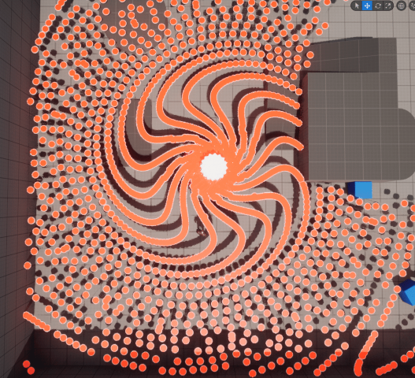
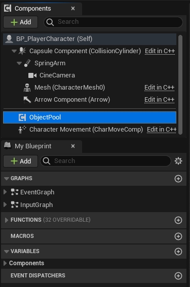
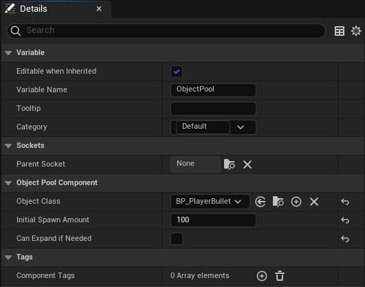
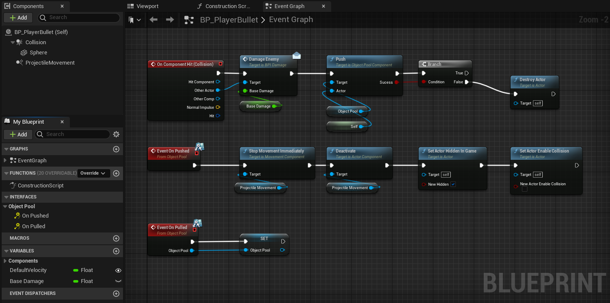


 
 # UnrealEngine-ObjectPool 

This is a plugin made for Unreal Engine 5 which supplies an [ObjectPool](https://en.wikipedia.org/wiki/Object_pool_pattern) packaged inside a blueprint component.

# Why

>[Wikipedia (Object pool pattern)](https://en.wikipedia.org/wiki/Object_pool_pattern) - The object pool pattern is a software creational design pattern that uses a set of initialised objects kept ready to use – a "pool" – rather than allocating and destroying them on demand. A client of the pool will request an object from the pool and perform operations on the returned object. When the client has finished, it returns the object to the pool rather than destroying it; this can be done manually or automatically.
>
>When it is necessary to work with numerous objects that are particularly expensive to instantiate and each object is only needed for a short period of time, the performance of an entire application may be adversely affected. An object pool design pattern may be deemed desirable in cases such as these.
>
>The object pool design pattern creates a set of objects that may be reused. When a new object is needed, it is requested from the pool. If a previously prepared object is available, it is returned immediately, avoiding the instantiation cost. If no objects are present in the pool, a new item is created and returned. When the object has been used and is no longer needed, it is returned to the pool, allowing it to be used again in the future without repeating the computationally expensive instantiation process. It is important to note that once an object has been used and returned, existing references will become invalid.
>
>Object pools are primarily used for performance: in some circumstances, object pools significantly improve performance. Object pools complicate object lifetime, as objects obtained from and returned to a pool are not actually created or destroyed at this time, and thus require care in implementation.

## TL;DR
When spawning a lot of objects fast and often it's better to allocate memory and instantiate the objects beforehand instead of spawning and allocating memory right before it's needed. This reduces hitches in the frame-time and general performance loss. When creating a bullet hell for an example you will be spawning hundreds if not thousands of bullets very oftenly. Instead of spawning a new actor each time we fire a bullet, we fetch an inactive already spawned one from the pool.

# Component & Interface based
This plugins supplies a component that you can add to any blueprint that's spawning a lot of actors. In my example above it's a "turret" shooting hundreds of bullets outward while rotating.

You decide beforehand what class the object pool should hold and how many instances it should spawn on BeginPlay().
You can also choose whether the pool should auto-expand if needed. Let's say the pool holds 10 objects, all of them are active at the moment and you try to pull another one from the pool. Then if this setting allows it, the pool will spawn a fresh instance and add it to the pool thus expanding it to the size of 11.

# Example

### BP_Turret
In this example a pool is holding a bullet actor. The blueprint responsible for spawning it simply pulls one from the pool, sets the location of it and runs the Fire() event.

### BP_EnemyBullet
The bullet inherits the ObjectPool interface which gives it the ability to execute logic when pushed/pulled from a pool. Since the OnPulled() event passes a reference to the pool itself, the bullet can push itself back to it when it has something and its purpose is done. Instead of normally destroying it.

